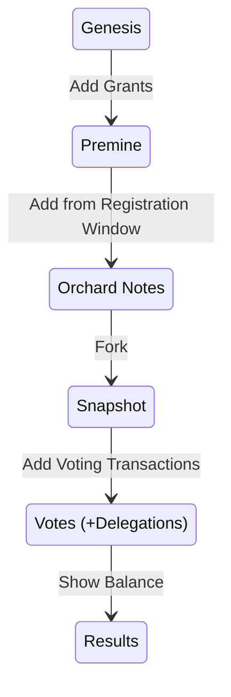

# Vote "Blockchain"

```admonish info
The Vote "Blockchain" is a public ledger of the data
needed to organize a secure and trustless election.
```

This is not a typical blockchain in the sense that
no mining takes place. The Election Authority maintains
the blockchain. It is *not* decentralized.

It goes through the following states.


