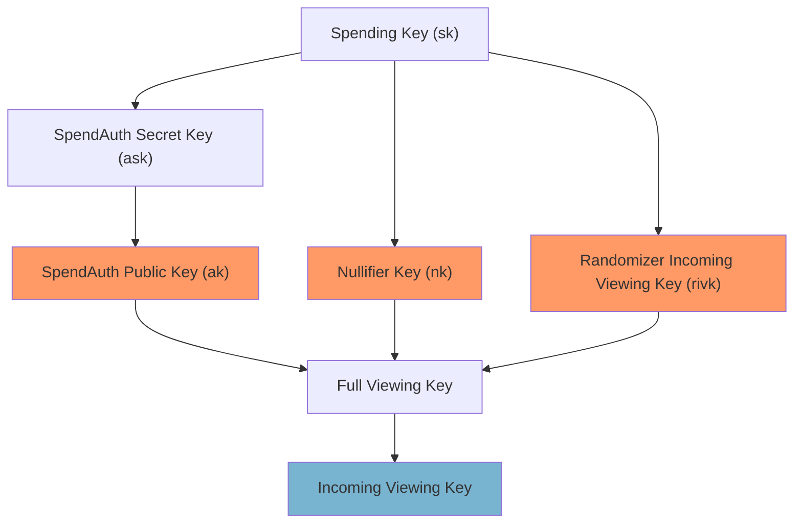
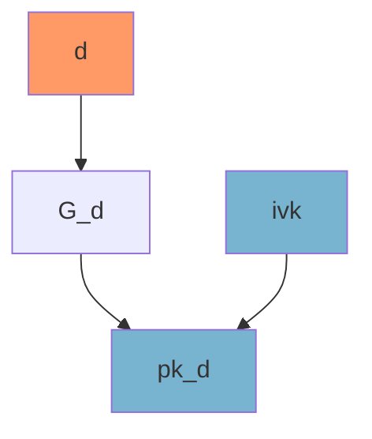
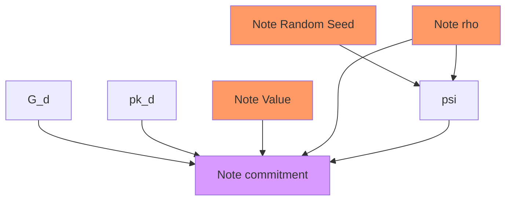
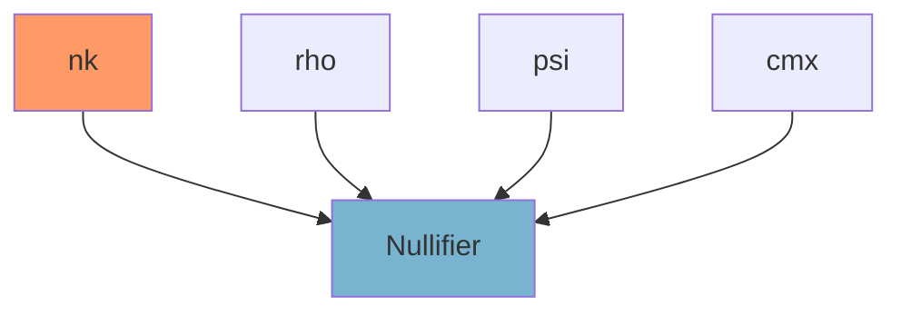
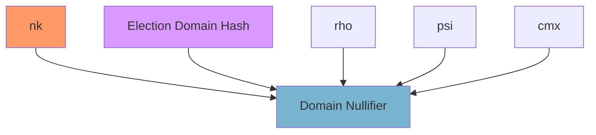

# Data Diagram

## Keys

```admonish note
This section is a refresher on some of the elements
of the Zcash protocol.
```

To be able to use a voting note, the voter must
know the **Spending Key**. The other keys are derived from it
as follows.

> The data in orange are secret inputs to the Voting circuit.
Data in blue is derived and used later. Data in purple are public
values.



## Spent Note

The spent note has an address, value, random seed `rseed`, and \\(\rho\\),
the nullifier of the action that created it.
The voting software or wallet decrypted the note with the Incoming Viewing
Key and was able to store all these values.

The address is a combination of the diversifier (`d`) and the public key (`pkd`)

### Address Integrity
The Address Integrity Statement checks that `pkd` comes from `d` and the `ivk`.



### Note Commitment

The Note Commitment Integrity Statement checks that
`cmx` is calculated from the note and the full viewing key.



### Nullifier Check

The Nullifier Integrity Statement checks that the nullifier
comes from the nullifier key `nk` and the spent note properties.
It is built from the note commitment `cmx`.

`nf` is the Zcash nullifier from the Main chain. It is public
over there and *secret* in the Voting chain.



### Election Domain Nullifier Check

This ED nullifier replaces the Zcash Nullifier in the Voting Chain.



### Nullifier Non-Inclusion Check

The secret nullifier `nf` *must* not be included in the
transactions from the Registration Window[^1].
Otherwise, the note is spent. It is fine for the nullifier
to appear after the snapshot height.

All the nullifiers from the Registration Window are sorted
as an LSB 256-bit integer to form a list: \\( (n_0, n_1, \dots, n_N) \\)

We want to prove that `nf` is *not* in the list.

If we want to prove that `nf` *was* in the list, we would use
a Merkle Tree. For an exclusion proof, we still use a Merkle Tree
but a slightly different one.

Instead of having the leaves \\( (n_0, n_1, \dots, n_N) \\),
we first form intervals that do not contain a nullifier.

Since \\(n_0\\) is the first nullifier, \\([0, n_0-1]\\)
does not contain a nullifier. Then \\([n_0+1, n_1-1]\\)
is the next interval, and so on so forth[^2].

The condition `nf` is not spent becomes equivalent to
1. there is an i such as \\([n_i+1, n_{i+1}-1]\\) is one of
these intervals, and
1. \\(nf \gt n_i\\)
1. \\(nf \lt n_{i+1}\\) 

The nullifiers are public information. Therefore, so are the
intervals.

The non-inclusion proof becomes the following.
There is a *secret* value n, such as:
1. n is a leaf of the Merkle Tree MT made of 
\\[0, n_0-1, n_0+1, n_1-1, n_1+1, \dots, F_p-1\\]
where \\(F_p\\) is the order of the base field of the Pallas curve.
1. n has an even position (i.e it is the start of an interval)
1. n' is the sibling leaf.
1. \\(nf \gt n\\)
1. \\(nf \lt n'\\)
1. The root of MT is the nullifier tree anchor. It is publicly
computed.

Or equivalently, 

> We know secret values \\(n\\) and merkle path \\(np\\)
> such as 
> 1. \\(n\\) and \\(np\\) hash to the root,
> 1. \\(nf \gt n\\)
> 1. \\(nf \gt np[0]\\)

because the first element of the Merkle Path is the sibling leaf.

## Alternate Implementation

Another, somewhat easier, way to implement a non-inclusion tree
is to use a Sparse Merkle Tree.

The Tree has \\( 2^{256} \\) leaves and 256 levels where
every used nullifier `nf` takes the spot at position `nf`[^3].

That's about 
99.99999999999999999999999999999999999999999999999999999999999999999999%[^4]
empty.

So even if the tree is too large, it is still possible to
compute the Merkle Paths.

Let \\(n_i = (p_i, h_i)\\), the list of nullifiers with
their position p and hash h.

For depth d from 0 to 256, go through the list
1. If the current element and the next are part of the
same pairs of nodes, combine them and skip the next item,
1. otherwise, calculate the position of the item. 
    - If it is the left node, merge with the "empty" root of depth d on the right;
    - If it is the right node, merge with the "empty" root of depth d on the left.

Empty roots of depth d are the root hash of the empty trees of height d.
They can be computed in constant time (relative to the number of notes),
or precached.

The path is 256 hashes long but contains in average the same number of
non-empty hashes than the previous implementation.

## Comparison between both approaches

### Tree of ranges

Pros
- Same length of Merkle Tree Path
- Same verification complexity for the path

Cons
- Additional range check in circuit

### Sparse Tree

Pros
- Same Verification Logic

Cons
- 256 vs 32 hashing in circuit

### Spending Signature Public Key

Every input is signed using the secret key associated with
its address. The signature is built from the *hash* of the
transaction, the public key of the address and the secret
key of the address.

In Bitcoin, the address is an encoding of the hash of the
public key. It is revealed in the spending transaction.

However, in Zcash, the public key should remain hidden.
If it was included in the spending transaction, it would
establish a link between all the transactions coming from
the same address.

Therefore, Zcash *randomizes* the public key. The spender
signs using a public key rk that is offset to the actual public
key pk by a random factor \\(\alpha\\).

The statement 
[spend-authority](circuit.md#spend-authority)
of the ZKP enforces that \\(\alpha\\) is known to the spender
and the signature on rk is as good as a signature on pk.

\\[
    \begin{align}
    \mathsf{rk} &= \mathsf{pk} + \alpha.G \\\\
    \mathsf{rsk} &= \mathsf{sk} + \alpha
    \end{align}
\\]

### Net Value Commitment Integrity

The value of the spent note contributes Voting Power v.
This is hidden by a Pedersen Hash that uses a trapdoor randomizer
rcv.

\\[ \mathsf{cv} = v.G + \mathsf{rcv}.H \\]

---

[^1]: The Registration Window could start from the Orchard
activation.
[^2]: If there are adjacent nullifiers, some intervals are empty. 
[^3]: Technically the range of nullifiers is less than \\(2 ^{256}\\),
because the order of \\(F_p\\) is not less than that.
[^4]: That's 70 number 9s.
