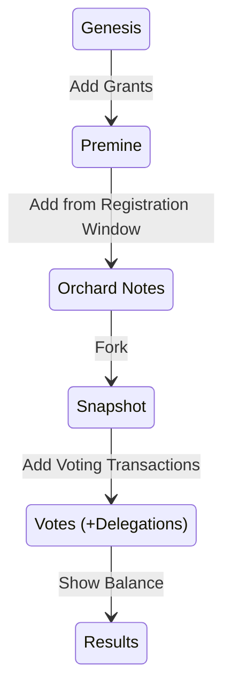

# Data Diagrams

## Vote "Blockchain"

```admonish info
The Vote "Blockchain" is a public ledger of the data
needed to organize a secure and trustless election.
```

This is not a typical blockchain in the sense that
no mining takes place. The Election Board maintains
the blockchain. It is *not* decentralized.

It goes through the following states.



## Block Structure

### Block Header

- prev hash
- election hash
- merkle root of commitment tree
- merkle root of nullifier tree
- signature

### Transactions

- orchard transactions
    - election nullifier
    - note commitment
    - value commitment
    - randomization factor
    - encrypted note + ephemeral key
    - zkp


## Genesis

The Genesis block is the block #0.
It contains the grants and its previous hash is the `election_hash`.

## Grants


## ZEC to Voting Power

## Delegations

## Votes

