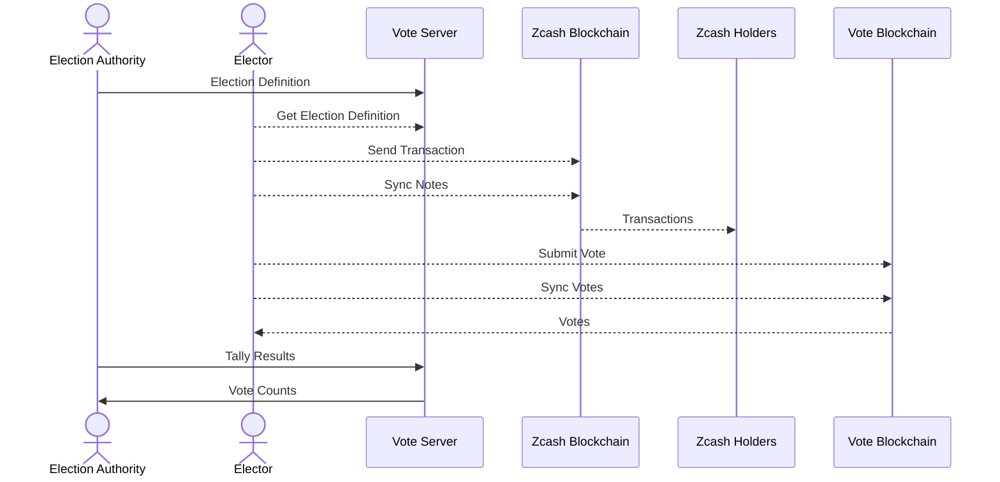

# Details

## Applicant background

I am a frequent contributor in the zcash community.

## Description of Problem or Opportunity

There are several possible applications besides elections
- referendums
- polls
- airdrops
- proving ownership of a balance of coins

With this scheme, users can keep their funds shielded at all times.
It is not necessary to move funds before or after voting.

Voters can delegate their voting power to other electors.

## Proposed Solution

- Use Orchard notes to prove balance
- Leverage Halo 2 and implement a voting mechanism
based on the Orchard transaction system

For more details, refer to the section
[Design]({{rootUrl}}/design/index.html) and the
[Example]({{rootUrl}}/usage/example.html) section.

## Solution Format

The Election Authority setups a Voting Server
and Voters can vote using their shielded Orchard coins.
Wallets such as `Ywallet` has a voting pannel,
users vote by *virtually* sending ZEC to a candidate
or a delegate. Their balance does not change.

The implementation is described in the section
[Implementation]({{rootUrl}}/implementation/index.html).

## Technical Approach

The Technical Approach is described in the
section [Design]({{rootUrl}}/design/index.html)

## Collaboration and Upstream Dependencies

The project depends on the Rust crates:
- librustzcash
- orchard
- halo2_proofs
- halo2_gadgets

Only orchard has source code dependencies, the other
are library dependencies.

## Execution risks

There is little execution risk since a prototype
was made (with a few limitations), and several
elections were carried out.

The participation was high, several hundred thousand
of ZEC were used in the votes.

## Unintended Consequences

I do not see any unintended consequences.

## Evaluation plan

Any organization or individual can use these tools
to start an election or poll the community of Zec
Holders.

Coins that want to airdrop Zcash holders (such as
Namada) could use this too.

Finally, Exchanges could prove their balance in ZEC
using this code.
