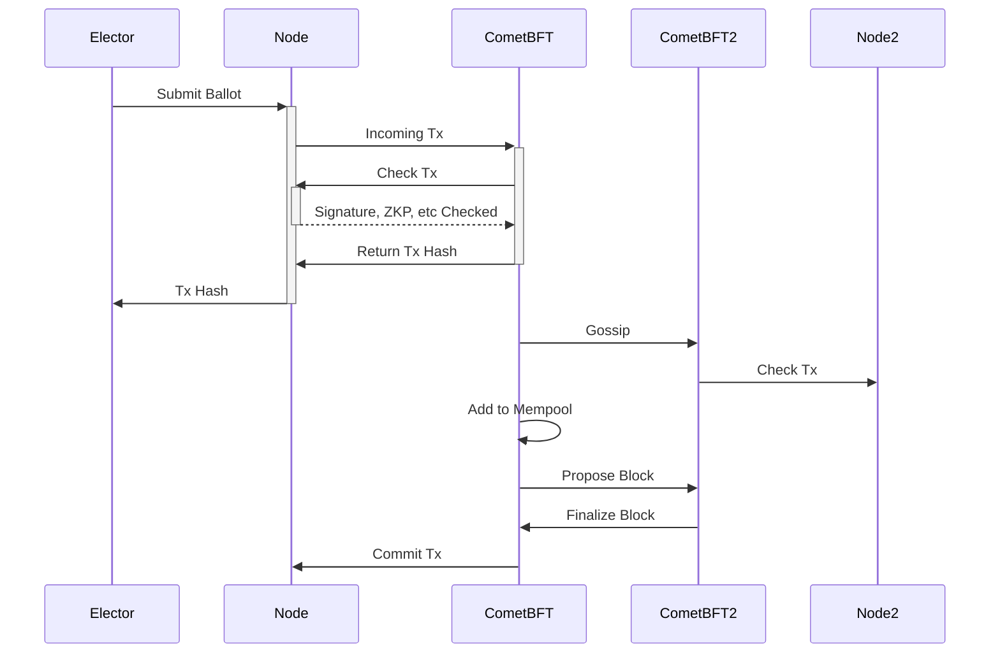

# BFT

The audit by Least Authority revealed a critical vulnerability
in the design described so far.

With a single vote server, therefore under the control
of a single authority, the election results can be tampered
without possible detection.

The Server Authority (SA) cannot modify the ballots because
of their signatures and hashes, but it can withhold them.

Furthermore, if the SA colludes with the Election Creator
and receives the seed phrase it may decrypt the ballots
on the fly and filter them based on any desired outcome.

This attack cannot be detected because third party
auditors cannot distinguish between a ballot discarded
by the SA from a ballot never sent by an elector.

Distributed systems without central authority have the
same issue. The solution is to introduce a consensus
engine.

The updated design of the voting server is *distributed*.
An election involves several servers under different
authorities. As long as more than 2/3 of the authorities
are honest (and do not filter ballots), the election
is guaranteed to be correct.

Now, electors submit their ballot to *any* of the vote
servers (of which there should be a minimum of four).

The workflow is described in the following sequence diagram:

The Vote Server is split into two binaries. The Node app `zcash-vote-server` and the CometBFT engine (`cometbft`)

The node receives ballots from the voting app like earlier
but does not *immediately* validate / store them in its database.

Instead, the ballot is sent to the CometBFT engine as a
transaction and it goes through the consensus workflow.

1. It gets checked. CometBFT asks the Node to check for
errors in the ballot. Ballots that include an incorrect ZKP or
signature are immediately rejected. So are ballots that double
spend voting power.
1. If the ballot is valid, it gets added to the CometBFT mempool
and gossipped to other servers. When another node receives
a ballot, it goes through the exact same process.
1. At a rate of around 1 block per second, the CometBFT
collects ballots from the mempool and proposes a block
1. Other validators cooperate to decide what block should be
added. They use a distributed algorithm to make sure that
the same block gets approved eventually.
1. Once the block is finalized, its transactions are removed
from the mempool
1. The node commits the change to its database

At this point, every node has the same state.
