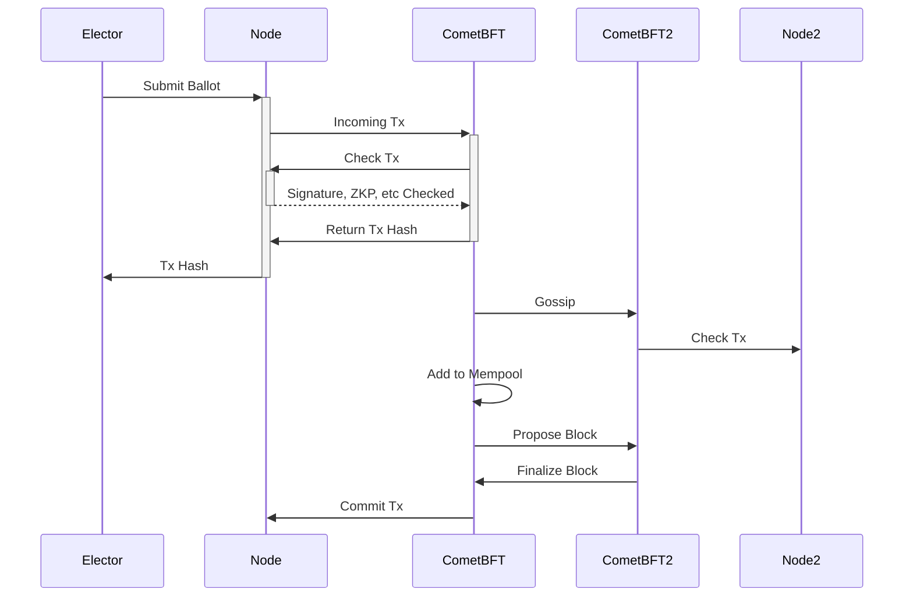

# BFT

The audit by Least Authority revealed a critical vulnerability
in the design described so far.

With a single vote server, therefore under the control
of a single authority, the election results can be tampered
without possible detection.

The Server Authority (SA) cannot modify the ballots because
of their signatures and hashes, but it can withhold them.

Furthermore, if the SA colludes with the Election Creator
and receives the seed phrase it may decrypt the ballots
on the fly and filter them based on any desired outcome.

This attack cannot be detected because third party
auditors cannot distinguish between a ballot discarded
by the SA from a ballot never sent by an elector.

Distributed systems without central authority have the
same issue. The solution is to introduce a consensus
engine.

The updated design of the voting server is *distributed*.
An election involves several servers under different
authorities. As long as more than 2/3 of the authorities
are honest (and do not filter ballots), the election
is guaranteed to be correct.

Now, electors submit their ballot to *any* of the vote
servers (of which there should be a minimum of four).

The workflow is described in the following sequence diagram:



The Vote Server is split into two binaries. The Node app `zcash-vote-server` and the CometBFT engine (`cometbft`)

The node receives ballots from the voting app like earlier
but does not *immediately* validate / store them in its database.

Instead, the ballot is sent to the CometBFT engine as a
transaction and it goes through the consensus workflow.

1. It gets checked. CometBFT asks the Node to check for
errors in the ballot. Ballots that include an incorrect ZKP or
signature are immediately rejected. So are ballots that double
spend voting power.
1. If the ballot is valid, it gets added to the CometBFT mempool
and gossipped to other servers. When another node receives
a ballot, it goes through the exact same process.
1. At a rate of around 1 block per second, the CometBFT
collects ballots from the mempool and proposes a block
1. Other validators cooperate to decide what block should be
added. They use a distributed algorithm to make sure that
the same block gets approved eventually.
1. Once the block is finalized, its transactions are removed
from the mempool
1. The node commits the change to its database

At this point, every node has the same state.

## How to setup multiple validators

In the following, we'll assume that four validators,
ECC, ZF, Zechub and ZCG want to run an election
together and be validators.

A representative of each organization must setup
a validator node based on the same `genesis.json`

First, everyone must download `cometbft` and initialize
an environment: `cometbft init`. This creates the directories
`$HOME/.cometbft` with `config` and `data` subdirectories.

We'll work with the files in the `config` directory.
- `config.toml`
- `genesis.json`
- `priv_validator_key.json`

One of the representative should be chosen to act as the
aggregator. They will combine the information provided
by the other representatives and distribute the final
`genesis.json` and `persistent_peers` config setting.

- Everyone besides the aggregator can delete their `genesis.json`
file.
- Everyone needs to send their validator config. It is
obtained by getting the `address` and `pub_key` fields
from the `priv_validator_key.json` file.

For example, if the file contains:
```json
{
  "address": "2A30C3FBDE75D364CFE6690648C2AD05B121D90B",
  "pub_key": {
    "type": "tendermint/PubKeyEd25519",
    "value": "A9de3I6FUB8VyGPHoLd4qMnfew5tfVcWyGeHBaa428g="
  },
  "priv_key": {
    "type": "tendermint/PrivKeyEd25519",
    "value": "7InC0JiIyekU+PwrC0TUGF7JZhk2sYRWflBGgksh7eYD117cjoVQHxXIY8egt3ioyd97Dm19VxbIZ4cFprjbyA=="
  }
}
```

They should send
```json
  "address": "2A30C3FBDE75D364CFE6690648C2AD05B121D90B",
  "pub_key": {
    "type": "tendermint/PubKeyEd25519",
    "value": "A9de3I6FUB8VyGPHoLd4qMnfew5tfVcWyGeHBaa428g="
  },
```

but *NOT* the `priv_key` part.

The aggregator adds a section:
```json
{
    "address": "2A30C3FBDE75D364CFE6690648C2AD05B121D90B",
    "pub_key": {
    "type": "tendermint/PubKeyEd25519",
    "value": "A9de3I6FUB8VyGPHoLd4qMnfew5tfVcWyGeHBaa428g="
    },
    "power": "10",
    "name": ""
}
```

to the validators array of `genesis.json`.

> Note that `power`[^1] and `name` should be added too.

The `genesis.json` file is ready and should be distributed to
every representative.

Now for the `config.toml`. The only line that must be changed
is the `persistent_peers`. We have to indicate the node addresses
of all the validators to seed the network.

- Every representative must run the command `cometbft show-node-id`.
This returns a hex string like `2ce74cac525f7553be19c0548b3b4ef09e49b6de`.
The node address is `<NODEID>@<IP>:<PORT>`. For example
`2ce74cac525f7553be19c0548b3b4ef09e49b6de@zechub.org:26656` [^2]

- Make sure to use the *external* IP address and open the p2p port to
incoming connections.

The `persistent_peers` is the concatentation of all four node addresses,
separated by a comma. Every validator should update their config file[^3].

CometBFT is configured to run an application blockchain.

## Extra Nodes

> The `genesis.json` and the `persistent_peers` should be made public
to allow other nodes to join the same network.
To setup a node, initialize cometbft, copy `genesis.json`
and update `persistent_peers`. These nodes are not blockchain
proposers/validators but they *validate* the ballots.

**Coin voting does not give any validation power to the votes.**

```admonish info
Running your own node guarantees that your vote will be counted.
```

---
[^1]: `power` can be adjusted if you want the validators to have different
weight.
[^2]: 26656 is the default peer to peer port. It can be changed in the config file.
[^3]: it doesn't hurt to have your own node address in the `persistent_peers`
list.
